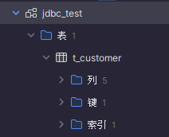
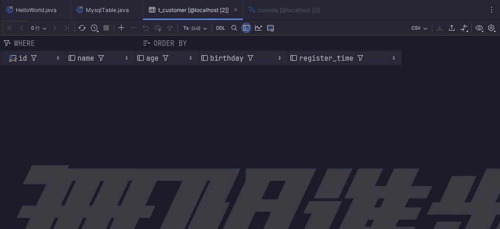
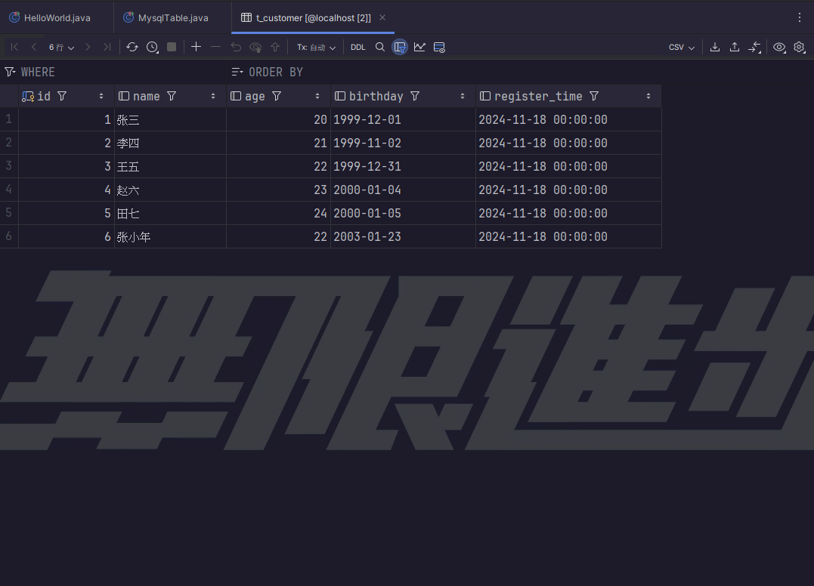

## 姓名：
## 学号：
### 1.	什么是Maven？
答：Maven是一个项目管理工具，用于管理Java项目，简化项目构建，管理依赖，自动化构建，发布等过程。
### 2.	介绍一下Maven的生命周期？
答：Maven的生命周期包含clean、validate、compile、test、package、install、deploy等阶段，每个阶段都有对应的任务，这些任务由插件完成。
### 3.	编程题

#### (1)	使用idea创建一个maven项目，项目名为maven_homework
项目结构：
```
maven_homework/
├── src
│   └── main 
│        ├── java
│        │     └── com
│        │           └── DJI
│        │                  └── HelloWorld.java
│        └── resources 
├── test
│    ├── java 
│    └── resources
└── pom.xml 
```
#### (2)	在项目中新建HelloWorld类，新建main方法，在控制台输出”hello,world”
代码：
```java
package com.DJI;
import org.junit.Test;
/*
 * @Description:
 * @Author: FallCicada
 * @Date: 2024/11/20/17:25
 * @LastEditors: 86138
 * @: 無限進步
 */
public class HelloWorld {
    public static void main(String[] args) {
        System.out.printf("hello,world");
    }
}
```
运行结果：
```
Picked up JAVA_TOOL_OPTIONS: -Dfile.encoding=UTF-8
hello,world
进程已结束，退出代码为 0
```
#### (3)	在项目中新建HelloWorld类，使用junit的单元测试功能在控制台输出”hello,maven”
代码：
```java
package com.DJI;
import org.junit.Test;
/*
 * @Description:
 * @Author: FallCicada
 * @Date: 2024/11/20/17:25
 * @LastEditors: 86138
 * @: 無限進步
 */
public class HelloWorld {
    public static void main(String[] args) {
        System.out.printf("hello,world");
    }
    @Test
    public void helloMaven(){
        System.out.printf("hello,maven");
    }
}
```
运行结果：
```
Picked up JAVA_TOOL_OPTIONS: -Dfile.encoding=UTF-8
hello,maven
进程已结束，退出代码为 0
```
#### (4)	在项目中安装mysql-connector-java依赖，完成第4题
pom.xml：
```xml
<?xml version="1.0" encoding="UTF-8"?>
<project xmlns="http://maven.apache.org/POM/4.0.0"
         xmlns:xsi="http://www.w3.org/2001/XMLSchema-instance"
         xsi:schemaLocation="http://maven.apache.org/POM/4.0.0 http://maven.apache.org/xsd/maven-4.0.0.xsd">
    <modelVersion>4.0.0</modelVersion>

    <groupId>com.DJI</groupId>
    <artifactId>maven_homework</artifactId>
    <version>1.0-SNAPSHOT</version>

    <properties>
        <maven.compiler.source>8</maven.compiler.source>
        <maven.compiler.target>8</maven.compiler.target>
        <project.build.sourceEncoding>UTF-8</project.build.sourceEncoding>
    </properties>
    <dependencies>
        <dependency>
            <groupId>junit</groupId>
            <artifactId>junit</artifactId>
            <version>4.13.2</version>
            <scope>compile</scope>
        </dependency>
        <dependency>
            <groupId>mysql</groupId>
            <artifactId>mysql-connector-java</artifactId>
            <version>8.0.27</version>
        </dependency>
    </dependencies>

</project>
```
#### 答：

### 4.	创建一个表 t_customer，包含字段有 `id` `name` `age` `birthday` `register_time`
项目结构：
```
maven_homework/
├── src
│   └── main 
│        ├── java
│        │     └── com
│        │           └── DJI
│        │                  ├──  HelloWorld.java
│        │                  ├──  Customer.java
│        │                  └──  MysqlTable.java
│        └── resources 
├── test
│    ├── java 
│    └── resources
└── pom.xml 
```
**完整代码**
MysqlTable.java：
```java
package com.DJI;

import org.junit.Test;

import java.sql.Connection;
import java.sql.DriverManager;
import java.sql.ResultSet;
import java.sql.Statement;
import java.util.ArrayList;
import java.util.List;

/*
 * @Description:
 * @Author: FallCicada
 * @Date: 2024/11/20/17:32
 * @LastEditors: 86138
 * @: 無限進步
 */
/*
 * 需求：创建一个表 t_customer，包含字段有 `id` `name` `age` `birthday` `register_time`
 *
 *  (1)	往表中插入多条数据
 *  (2)	查找2000.1.1前出生的客户信息，解析查询结果
 *  (3)	将结果封装到Customer对象中，最后添加到一个List集合中
 */
public class MysqlTable {
    // 1. 驱动
    String driver = "com.mysql.cj.jdbc.Driver";
    // 2. 数据库地址
    String url = "jdbc:mysql://127.0.0.1:3306/jdbc_test";
    // 3. 用户名 - 写自己数据库的用户名
    String username = "fallcicada";
    // 4. 密码 - 写自己数据库的密码
    String password = "9572";
    // 获取数据库连接 并输出连接对象
    @Test
    public void createTable() {
        Connection conn = null;
        Statement stmt = null;
        try {
            // 1. 注册驱动
            Class.forName(driver);
            // 2. 获取连接对象
            conn = DriverManager.getConnection(url, username, password);
            // 输出连接对象
            System.out.println(conn);
            // 3. 获取数据库操作对象
            stmt = conn.createStatement();
            // 4. 执行sql
            String sql = "CREATE DATABASE IF NOT EXISTS jdbc_test";
            stmt.executeUpdate(sql);
            sql = "CREATE TABLE IF NOT EXISTS jdbc_test.t_customer (" +
                    "id INT PRIMARY KEY AUTO_INCREMENT, " +
                    "name VARCHAR(20), " +
                    "age INT, " +
                    "birthday DATE, " +
                    "register_time DATETIME)";
            // 5. 处理查询结果
            int count = stmt.executeUpdate(sql);
            // 输出受影响的行数
            System.out.println(count);
        } catch (Exception e) {
            e.printStackTrace();
        } finally {
            // 6. 释放资源
            try {
                if (stmt != null) stmt.close();
                if (conn != null) conn.close();
            } catch (Exception e) {
                e.printStackTrace();
            }
        }
    }
    //插入数据
    @Test
    public void insertData() {
        Connection conn = null;
        Statement stmt = null;
        try {
            // 1. 注册驱动
            Class.forName(driver);
            // 2. 获取连接对象
            conn = DriverManager.getConnection(url, username, password);
            // 3. 获取数据库操作对象
            stmt = conn.createStatement();
            // 4. 执行sql
            String sql = "INSERT INTO jdbc_test.t_customer (name, age, birthday, register_time) VALUES " +
                    "('张三', 20, '1999-12-01', '2024-11-18'), " +
                    "('李四', 21, '1999-11-02', '2024-11-18'), " +
                    "('王五', 22, '1999-12-31', '2024-11-18'), " +
                    "('赵六', 23, '2000-01-04', '2024-11-18'), " +
                    "('田七', 24, '2000-01-05', '2024-11-18'), " +
                    "('张小年',22,'2003-01-23','2024-11-18') ";
            // 5. 处理查询结果
            int count = stmt.executeUpdate(sql);
            // 输出受影响的行数
            System.out.println(count);
        } catch (Exception e) {
            e.printStackTrace();
        } finally {
            // 6. 释放资源
            try {
                if (stmt != null) stmt.close();
                if (conn != null) conn.close();
            } catch (Exception e) {
                e.printStackTrace();
            }
        }
    }
    //查找2000.1.1前出生的客户信息
    @Test
    public void selectData() {
        try {
            // 注册 MySQL JDBC 驱动
            Class.forName(driver);
            // 使用 try-with-resources 语句自动管理资源，确保在方法结束时关闭连接和语句对象
            try (Connection conn = DriverManager.getConnection(url, username, password);
                 Statement stmt = conn.createStatement()) {
                // 再次注册驱动
                Class.forName(driver);
                // 定义 SQL 查询语句，选择生日在 2000-01-01 之前的客户信息
                String sql = "SELECT * FROM jdbc_test.t_customer WHERE birthday < '2000-01-01'";
                // 执行 SQL 查询并获取结果集
                ResultSet rs = stmt.executeQuery(sql);
                // 处理查询结果
                while (rs.next()) { // 遍历结果集中的每一行
                    // 获取当前行的 ID
                    int id = rs.getInt("id");
                    // 获取当前行的名字
                    String name = rs.getString("name");
                    // 获取当前行的年龄
                    int age = rs.getInt("age");
                    // 获取当前行的生日
                    String birthday = rs.getString("birthday");
                    // 获取当前行的注册时间
                    String registerTime = rs.getString("register_time");
                    // 打印当前行的信息
                    System.out.println("ID: " + id + ", Name: " + name + ", Age: " + age +
                            ", Birthday: " + birthday + ", Register Time: " + registerTime);
                }
            } catch (Exception e) {
                // 捕获并打印异常堆栈信息
                e.printStackTrace();
            }
        } catch (ClassNotFoundException e) {
            // 如果找不到驱动类，抛出运行时异常
            throw new RuntimeException(e);
        }// 无需释放资源，try-with-resources 语句会自动关闭连接和语句对象
    }
    //(3) 将结果封装到Customer对象中，最后添加到一个List集合中
    @Test
    public void selectDataAndEncapsulate() {
        List<Customer> customers = new ArrayList<>();
        try {
            // 注册 MySQL JDBC 驱动
            Class.forName(driver);
            // 使用 try-with-resources 语句自动管理资源，确保在方法结束时关闭连接和语句对象
            try (Connection conn = DriverManager.getConnection(url, username, password);
                 Statement stmt = conn.createStatement()) {
                // 定义 SQL 查询语句，选择生日在 2000-01-01 之前的客户信息
                String sql = "SELECT * FROM jdbc_test.t_customer WHERE birthday < '2000-01-01'";
                // 执行 SQL 查询并获取结果集
                ResultSet rs = stmt.executeQuery(sql);
                // 处理查询结果
                while (rs.next()) { // 遍历结果集中的每一行
                    // 获取当前行的 ID
                    int id = rs.getInt("id");
                    // 获取当前行的名字
                    String name = rs.getString("name");
                    // 获取当前行的年龄
                    int age = rs.getInt("age");
                    // 获取当前行的生日
                    String birthday = rs.getString("birthday");
                    // 获取当前行的注册时间
                    String registerTime = rs.getString("register_time");
                    // 封装到 Customer 对象中
                    Customer customer = new Customer(id, name, age, birthday, registerTime);
                    // 添加到 List 集合中
                    customers.add(customer);
                }
            } catch (Exception e) {
                // 捕获并打印异常堆栈信息
                e.printStackTrace();
            }
        } catch (ClassNotFoundException e) {
            // 如果找不到驱动类，抛出运行时异常
            throw new RuntimeException(e);
        }
        System.out.println("遍历集合并输出");
        // 打印封装后的客户信息
        for (Customer customer : customers) {
            System.out.println(customer);
        }
    }
}
```
Customer.java:
```java
package com.DJI;

/*
 * @Description:
 * @Author: FallCicada
 * @Date: 2024/11/20/18:59
 * @LastEditors: 86138
 * @: 無限進步
 */
public class Customer {
    private int id;
    private String name;
    private int age;
    private String birthday;
    private String register_time;
    public Customer() {
    }
    public Customer(int id, String name, int age, String birthday, String register_time) {
        this.id = id;
        this.name = name;
        this.age = age;
        this.birthday = birthday;
        this.register_time = register_time;
    }
    @Override
    public String toString() {
        return "Customer{" +
                "id=" + id +
                ", name='" + name + '\'' +
                ", age=" + age +
                ", birthday='" + birthday + '\'' +
                ", register_time='" + register_time + '\'' +
                '}';
    }
}
```
建表前：


运行结果：
```
Picked up JAVA_TOOL_OPTIONS: -Dfile.encoding=UTF-8
com.mysql.cj.jdbc.ConnectionImpl@281e3708
0
```
运行后：



#### (1)	往表中插入多条数据
代码：
```java
@Test
    public void insertData() {
        Connection conn = null;
        Statement stmt = null;
        try {
            // 1. 注册驱动
            Class.forName(driver);
            // 2. 获取连接对象
            conn = DriverManager.getConnection(url, username, password);
            // 3. 获取数据库操作对象
            stmt = conn.createStatement();
            // 4. 执行sql
            String sql = "INSERT INTO jdbc_test.t_customer (name, age, birthday, register_time) VALUES " +
                    "('张三', 20, '1999-12-01', '2024-11-18'), " +
                    "('李四', 21, '1999-11-02', '2024-11-18'), " +
                    "('王五', 22, '1999-12-31', '2024-11-18'), " +
                    "('赵六', 23, '2000-01-04', '2024-11-18'), " +
                    "('田七', 24, '2000-01-05', '2024-11-18'), " +
                    "('张小年',22,'2003-01-23','2024-11-18') ";
            // 5. 处理查询结果
            int count = stmt.executeUpdate(sql);
            // 输出受影响的行数
            System.out.println(count);
        } catch (Exception e) {
            e.printStackTrace();
        } finally {
            // 6. 释放资源
            try {
                if (stmt != null) stmt.close();
                if (conn != null) conn.close();
            } catch (Exception e) {
                e.printStackTrace();
            }
        }
    }
```
运行结果：
```
Picked up JAVA_TOOL_OPTIONS: -Dfile.encoding=UTF-8
6
```

#### (2)	查找2000.1.1前出生的客户信息，解析查询结果
代码：
```java
//查找2000.1.1前出生的客户信息
    @Test
    public void selectData() {
        try {
            // 注册 MySQL JDBC 驱动
            Class.forName(driver);
            // 使用 try-with-resources 语句自动管理资源，确保在方法结束时关闭连接和语句对象
            try (Connection conn = DriverManager.getConnection(url, username, password);
                 Statement stmt = conn.createStatement()) {
                // 再次注册驱动
                Class.forName(driver);
                // 定义 SQL 查询语句，选择生日在 2000-01-01 之前的客户信息
                String sql = "SELECT * FROM jdbc_test.t_customer WHERE birthday < '2000-01-01'";
                // 执行 SQL 查询并获取结果集
                ResultSet rs = stmt.executeQuery(sql);
                // 处理查询结果
                while (rs.next()) { // 遍历结果集中的每一行
                    // 获取当前行的 ID
                    int id = rs.getInt("id");
                    // 获取当前行的名字
                    String name = rs.getString("name");
                    // 获取当前行的年龄
                    int age = rs.getInt("age");
                    // 获取当前行的生日
                    String birthday = rs.getString("birthday");
                    // 获取当前行的注册时间
                    String registerTime = rs.getString("register_time");
                    // 打印当前行的信息
                    System.out.println("ID: " + id + ", Name: " + name + ", Age: " + age +
                            ", Birthday: " + birthday + ", Register Time: " + registerTime);
                }
            } catch (Exception e) {
                // 捕获并打印异常堆栈信息
                e.printStackTrace();
            }
        } catch (ClassNotFoundException e) {
            // 如果找不到驱动类，抛出运行时异常
            throw new RuntimeException(e);
        }// 无需释放资源，try-with-resources 语句会自动关闭连接和语句对象
    }
```
运行结果：
```
Picked up JAVA_TOOL_OPTIONS: -Dfile.encoding=UTF-8
ID: 1, Name: 张三, Age: 20, Birthday: 1999-12-01, Register Time: 2024-11-18 00:00:00
ID: 2, Name: 李四, Age: 21, Birthday: 1999-11-02, Register Time: 2024-11-18 00:00:00
ID: 3, Name: 王五, Age: 22, Birthday: 1999-12-31, Register Time: 2024-11-18 00:00:00
```
#### (3)将结果封装到Customer对象中，最后添加到一个List集合中
代码：
```java
 @Test
    public void selectDataAndEncapsulate() {
        List<Customer> customers = new ArrayList<>();
        try {
            // 注册 MySQL JDBC 驱动
            Class.forName(driver);
            // 使用 try-with-resources 语句自动管理资源，确保在方法结束时关闭连接和语句对象
            try (Connection conn = DriverManager.getConnection(url, username, password);
                 Statement stmt = conn.createStatement()) {
                // 定义 SQL 查询语句，选择生日在 2000-01-01 之前的客户信息
                String sql = "SELECT * FROM jdbc_test.t_customer WHERE birthday < '2000-01-01'";
                // 执行 SQL 查询并获取结果集
                ResultSet rs = stmt.executeQuery(sql);
                // 处理查询结果
                while (rs.next()) { // 遍历结果集中的每一行
                    // 获取当前行的 ID
                    int id = rs.getInt("id");
                    // 获取当前行的名字
                    String name = rs.getString("name");
                    // 获取当前行的年龄
                    int age = rs.getInt("age");
                    // 获取当前行的生日
                    String birthday = rs.getString("birthday");
                    // 获取当前行的注册时间
                    String registerTime = rs.getString("register_time");
                    // 封装到 Customer 对象中
                    Customer customer = new Customer(id, name, age, birthday, registerTime);
                    // 添加到 List 集合中
                    customers.add(customer);
                }
            } catch (Exception e) {
                // 捕获并打印异常堆栈信息
                e.printStackTrace();
            }
        } catch (ClassNotFoundException e) {
            // 如果找不到驱动类，抛出运行时异常
            throw new RuntimeException(e);
        }
        System.out.println("遍历集合并输出");
        // 打印封装后的客户信息
        for (Customer customer : customers) {
            System.out.println(customer);
        }
    }
```
运行结果：
```
Picked up JAVA_TOOL_OPTIONS: -Dfile.encoding=UTF-8
遍历集合并输出
Customer{id=1, name='张三', age=20, birthday='1999-12-01', register_time='2024-11-18 00:00:00'}
Customer{id=2, name='李四', age=21, birthday='1999-11-02', register_time='2024-11-18 00:00:00'}
Customer{id=3, name='王五', age=22, birthday='1999-12-31', register_time='2024-11-18 00:00:00'}

```
参考：
```xml
<dependency> 
<groupId>mysql</groupId> 
<artifactId>mysql-connector-java</artifactId> 
<version>8.0.27</version> 
</dependency>
```
