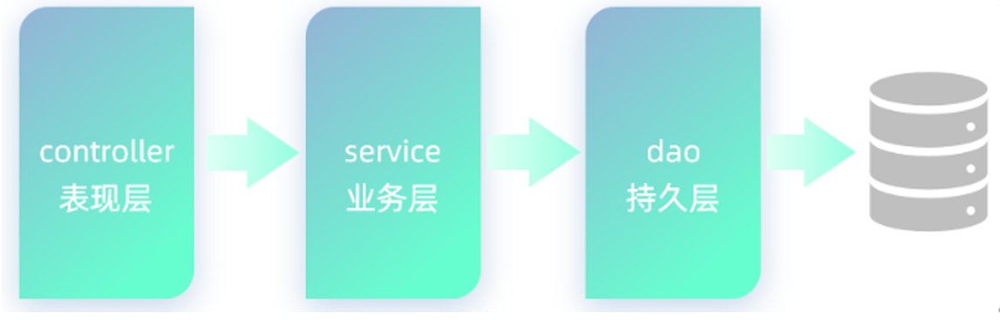

<!--
 * @Description: 
 * @Author: FallCicada
 * @Date: 2024-11-25 08:41:50
 * @LastEditors: FallCicada
 * @LastEditTime: 2024-11-25 09:02:10
 * @: 無限進步
-->
# Mybatis
在前面我们学习MySQL数据库时，要么利用图形化客户端工具(如：idea、datagrip)，来操作数据库，要么使用在Java代码中使用JDBC操作数据库。

>在客户端工具中，编写增删改查的SQL语句，发给MySQL数据库管理系统，由数据库管理系统执行SQL语句并返回执行结果。
>
>增删改操作：返回受影响行数
>
>查询操作：返回结果集(查询的结果)

我们做为后端程序开发人员，实际项目开发中通常会使用Mybatis来操作数据
库。

什么是MyBatis?

- MyBatis是一款优秀的 **持久层 框架**，用于简化JDBC的开发。
- MyBatis本是 Apache的一个开源项目iBatis，2010年这个项目由apache迁移到了google code，并且改名为MyBatis 。2013年11月迁移到Github。
- 官网：https://mybatis.org/mybatis-3/zh/index.html 

在上面我们提到了两个词：一个是持久层，另一个是框架。

- 持久层：指的是就是数据访问层(dao)，是用来操作数据库的。

- 框架：是一个半成品软件，是一套可重用的、通用的、软件基础代码模型。在框架的基础上进行软件开发更加高效、规范、通用、可拓展。

|||||
|:-----------:|:---------:|:-----:|:-------:|
|controller ->|表现层|处理用户请求和相应数据||
|service ->   |业务层|处理业务逻辑         ||
|dao ->       |持久层|操作数据库       ||
|mapperer ->  |数据库|           ||

# 入门
Mybatis操作数据库的步骤：
1. 准备工作(创建springboot工程、数据库表t_user、实体类User)
2. 引入Mybatis的相关依赖，配置Mybatis(数据库连接信息)
3. 编写SQL语句

在正式创建SpringBoot项目之前，我们先大致了解下SpringBoot及项目结构。

## SpringBoot 
是由Pivotal团队提供的全新框架，其设计目的是用来简化Spring应用的初始搭建以及开发过程。
**Spring创建方式**：
1. idea直接创建
   - 一部分低版本JDK不支持直接创建 
2. 从官方网站创建下载项目
   -  
**Spring程序缺点**：
- 配置繁琐
- 依赖设置繁琐
**SpringBoot程序优点**：
- 自动配置
- 起步依赖（简化依赖配置）
- 辅助功能（内置服务器等）
**SpringBoot项目结构**：